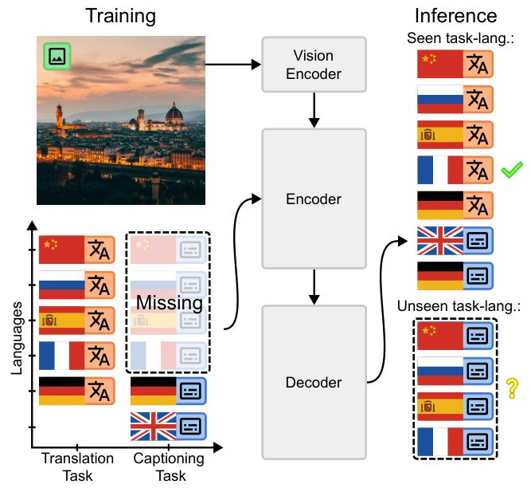

# [Scaling Laws for Conditional Emergence of Multilingual Image Captioning via Generalization from Translation](https://arxiv.org/abs/2503.09443)

<a href="https://arxiv.org/abs/2503.09443"></a>
<a href="https://spravil.com/projects/caption_via_translation/" alt="Project Page"> </a>
<a href="https://huggingface.co/collections/Spravil/caption-via-translation" alt="HuggingFace"></a>

Official PyTorch implementation for our paper [Scaling Laws for Conditional Emergence of Multilingual Image Captioning via Generalization from Translation (AAAI 2026)](https://arxiv.org/abs/2503.09443).



## Usage

### Setup

```bash
uv venv --python 3.10
uv sync --dev
uv pip install -e .
```

### Setup Continous Pretraining Dataset

Continue [here](scripts/README.md) to setup the synthetic pretraining dataset with incomplete task-language coverage.

### Setup Downstream Dataset

Continue [here](scripts/finetuning_dataset/README.md) to setup the finetuning dataset based on Multi30K, COCO Karpathy, DOCCI, ImageParagraphs.

## Training

### Prepare Checkpoints

We need to preprocess the model checkpoints.
1) Remap the decoder embeddings for Florence-2 to match the Gemma-2 tokenizer.
2) Insert the Florence-2 vision backbone and cross-attention layers into Gemma-2.
These steps allow us to load the model faster.

```bash
python src/prepare.py
```

The script generates tokenizer mappings and an `init_state_dict.pt` file for the Florence-2 base and large models, as well as the Gemma-2-2B and Gemma-2-9B models with the Florence-2 large vision backbone.

### Start Training

The folder `slurm/` contains training scripts for the different model sizes for continous pretraining and finetuning.

## Evaluation

### CE Loss Evaluation

To fit the scaling laws, we measure cross-entropy loss on a synthetic evaluation set.

```bash
python src/eval_loss.py 
    --batch_size 8 # Batch size for eval
    --eval_dataset_root_path {} # Eval dataset path data/...
    --dataset_stats_file {} # The dataset stats file data/tok_counts.json
    --pretrained_path {}  # The checkpoint path
    --training_steps 10_000 # The number of training steps 500, 2000, 5000, 10000
    --training_batch_size 1024  # Batch size used for pre-training
    --model_name {} # Choose microsoft/Florence-2-base, microsoft/Florence-2-large, florence-gemma-2-large, florence-gemma-2-xlarge
```

### Downstream Evaluation

Run evaluation on Multi30K, COCO Karpathy, DOCCI, ImageParagraphs, CoMMuTE, and XM3600.

```bash
python src/eval.py 
    --model_name {} # Name of the model
    --model_type {} # Model type
    --input_res 768 # 224 or 768
    --model_path {} # Path to fine-tuned model
    --batch_size 8 # Batch size for eval
    --eval_task_set full # Task set selection
    --use_prefix # Append a prefix to the decoder input
```

## Acknowledgments

Our implementation is based on [transformers](https://github.com/huggingface/transformers), [Gemma 2](https://huggingface.co/google/gemma-2-2b), and [Florence 2](https://huggingface.co/microsoft/Florence-2-base).
This research has been funded by the Federal Ministry of Research, Technology and Space of Germany under grant no. 01IS23004B RIDMI and 01IS22094C WEST-AI.
Computational resources were provided by the German AI Service Center WestAI.

## Bibtex

```
@inproceedings{spravil2026scaling,
  title={Scaling Laws for Conditional Emergence of Multilingual Image Captioning via Generalization from Translation},
  author={Spravil, Julian and Houben, Sebastian and Behnke, Sven},
  booktitle={Proceedings of the 40th AAAI Conference on Artificial Intelligence},
  year={2026}
}
```